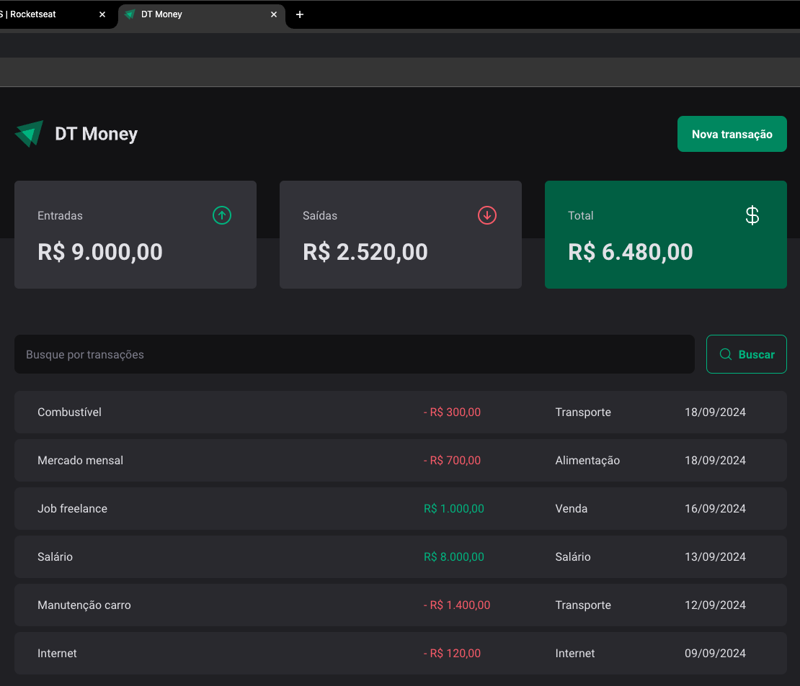
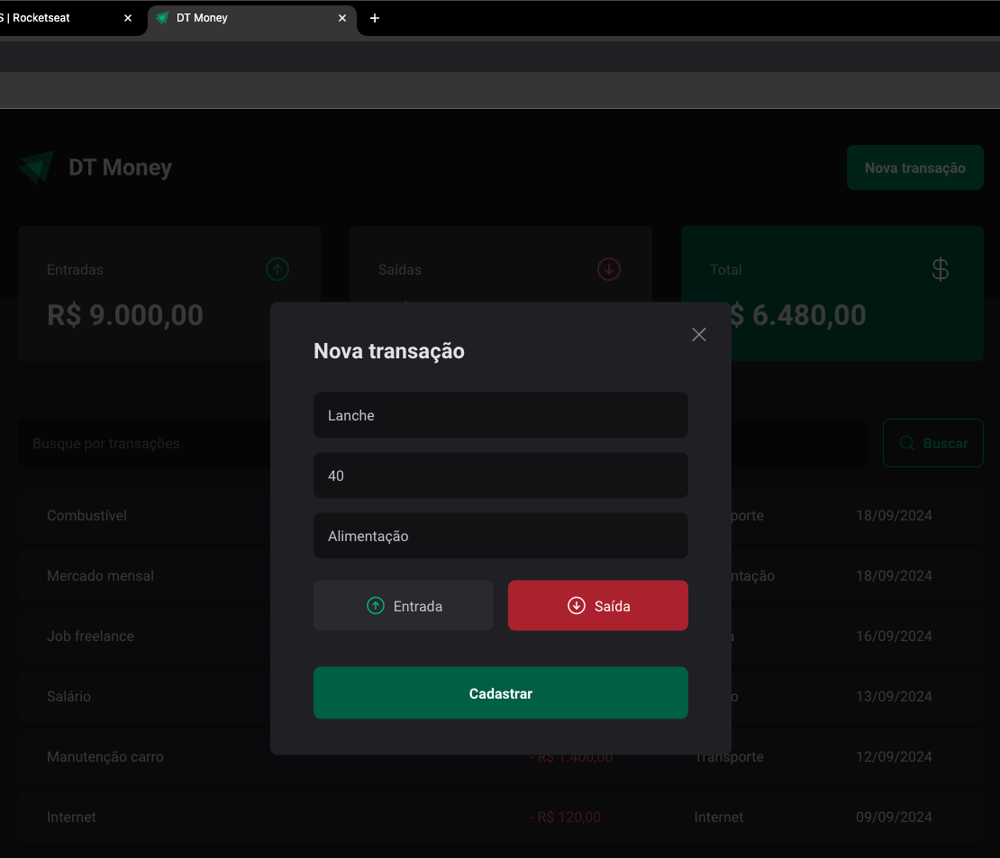

# Ignite - DT Money
This project is a **Cash flow application**  developed using **React**, **TypeScript**, and **Vite**. The project is part of the **Rocketseat Ignite course**. In this project, I followed the instructions and coded it while watching the lessons. The goal was to solidify my understanding of modern web development practices and improve my TypeScript skills, focus on performance and how to consume APIs.

## Tech Stack 
 
- **React** : For building the user interface.
 
- **TypeScript** : To ensure type safety and better code maintenance.
 
- **Vite** : A fast and efficient build tool for modern web applications.

- **React Hook Form** : For managing form state and validation in an easy and scalable way, providing a simple API for forms and better performance.

- **Zod** : For schema-based form validation, ensuring that form inputs adhere to strict data types and rules, enhancing the overall reliability and error handling in the application.

- **Memo** : Optimizes performance by preventing unnecessary re-renders.
 
- **context-selector** : Improves performance by avoiding unnecessary re-renders in context-based components.
 
- **json-server** : A simple mock API for simulating backend responses during development.
 
- **axios** : Handles HTTP requests for fetching data.
 
- **radix-ui** : Provides accessible, customizable UI components.

## Print Screen

